# MicroSpringBoot - IoC Framework for Java Web Applications

## Project Description

This project implements a **custom HTTP web server** in Java (Apache) with **Inversion of Control (IoC)** capabilities similar to Spring Boot. The server is capable of:

- Serving HTML pages and PNG images
- Building web applications from POJOs (Plain Old Java Objects)
- Automatically scanning components with annotations
- Handling non-concurrent HTTP requests
- Supporting custom annotations: `@RestController`, `@GetMapping`, `@RequestParam`


---

## Framework Architecture

### Main Components

1. **HttpServer**: HTTP server listening on port 8080
   - Handles HTTP GET requests
   - Routes requests to corresponding controllers
   - Serves static files from `/webroot`

2. **ComponentScanner**: Automatic classpath scanning
   - Searches for classes annotated with `@RestController`
   - Registers methods with `@GetMapping`
   - Processes parameters with `@RequestParam`

3. **Custom Annotations**:
   - `@RestController`: Marks classes as web controllers
   - `@GetMapping(path)`: Maps methods to HTTP routes
   - `@RequestParam(value, defaultValue)`: Injects query parameters

4. **WebFramework**: Main entry point
   - Initializes ComponentScanner
   - Configures static files
   - Starts the HTTP server

---

## Implemented Features

### 1. Functional HTTP Server

The server starts and listens on port 8080:  

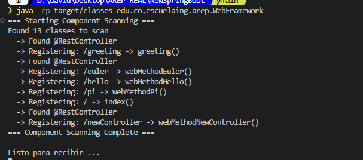

### 2. Index Page with Available Endpoints

The server serves a static HTML page listing all endpoints:  

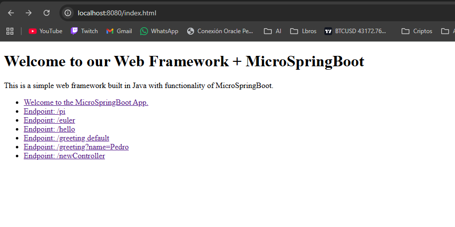

### 3. Endpoints with Annotations

#### Main Endpoint "/"  
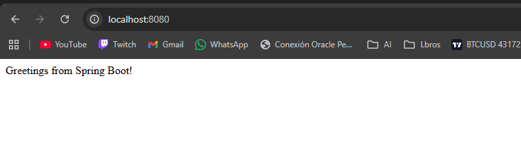

#### Endpoint "/pi"
Returns the value of PI using reflection:  
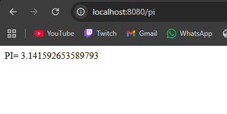 

#### Endpoint "/euler"
Returns Euler's number:  
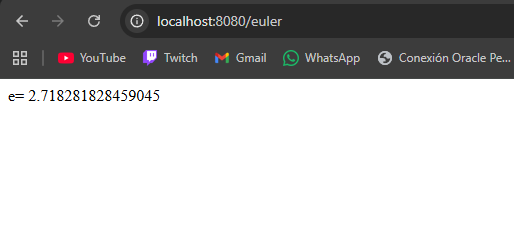

#### Endpoint "/hello"
Simple greeting without parameters:  
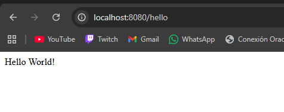

### 4. @RequestParam Support

Greeting with default value  
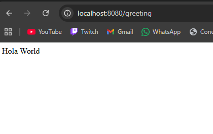

#### Greeting with custom parameter
The framework automatically injects the `name` parameter:  
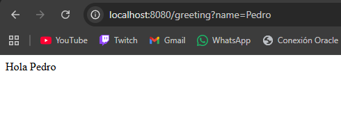

### 5. Automatic Controller Scanning

The framework automatically finds and registers new controllers:  
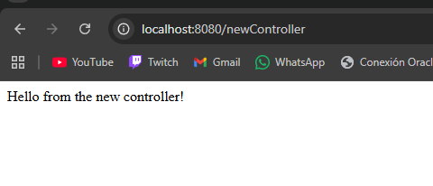

---

## Local Installation and Execution

### Prerequisites

- **Java 17** or higher
- **Maven 3+**
- **Git**

### Step 1: Clone the Repository

```bash
git clone https://github.com/DASarria/NewSpringBoot.git
cd NewSpringBoot
```

### Step 2: Compile the Project

```bash
mvn clean compile
```

### Step 3: Run the Server

```bash
java -cp target/classes edu.co.escuelaing.arep.WebFramework
```

### Step 4: Access the Application

Open your browser and visit:

```
http://localhost:8080/
```

### Available Endpoints

| Route | Description |
|-------|-------------|
| `/` | Welcome page |
| `/pi` | Returns the value of PI |
| `/euler` | Returns Euler's number |
| `/hello` | Simple greeting |
| `/greeting` | Greeting with optional parameter `?name=YourName` |
| `/newController` | Dynamic controller example |

---

## ☁️ AWS EC2 Deployment

### Step 1: Create EC2 Instance

Create an EC2 instance on AWS with the following characteristics:

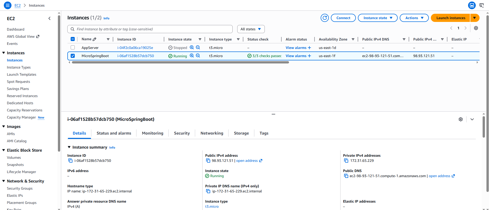

- **Type**: t2.micro (Free Tier)
- **Operating System**: Amazon Linux or Ubuntu
- **Security Group**: Allow traffic on port 8080

### Step 2: Connect to the Instance

```bash
ssh -i your-key.pem ec2-user@your-instance-ip
```

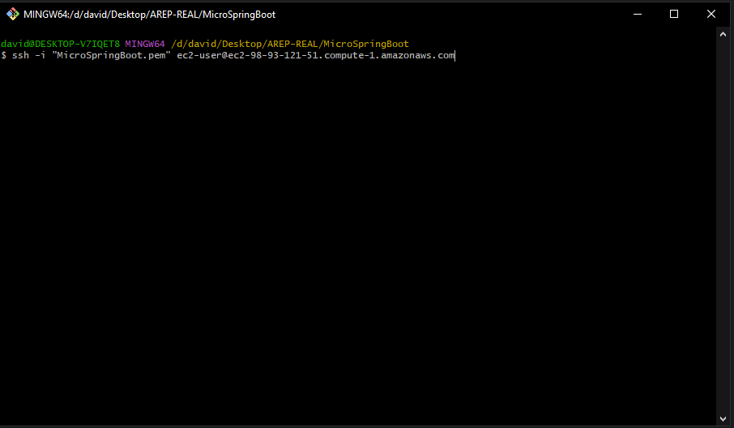

### Step 3: Install Java 21

```bash
sudo yum install java-21-amazon-corretto-devel
```

### Step 4: Upload Compiled Files

From your local machine:

```bash
sftp -i your-key.pem ec2-user@your-instance-ip
```

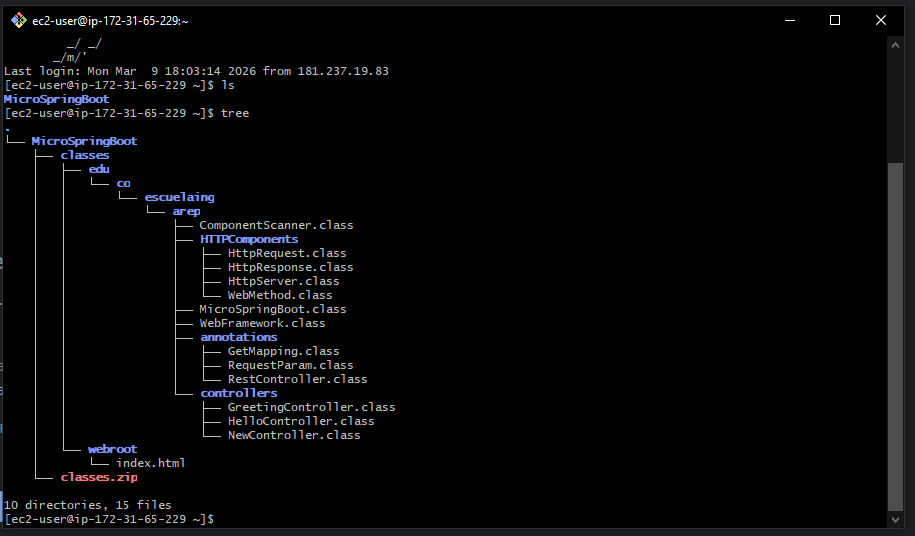

### Step 5: Run the Framework on EC2

```bash
cd classes
java -cp edu.co.escuelaing.arep.WebFramework
```

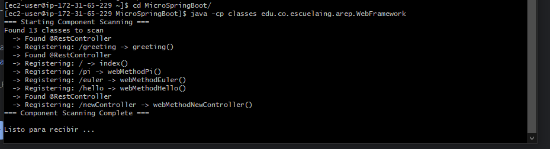

### Step 6: Verify Endpoints on AWS

Access from your browser using your EC2 instance's public IP:

```
http://your-ec2-public-ip:8080/
```

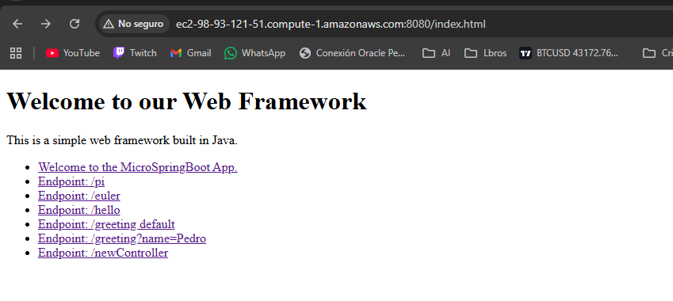

### Production Usage Examples

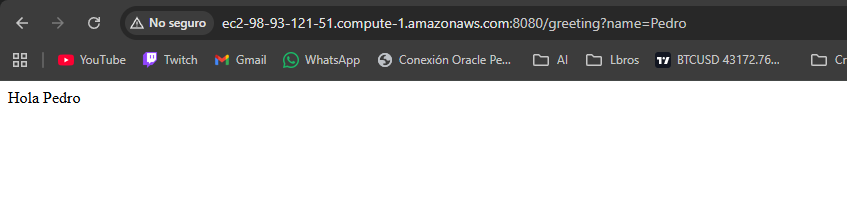
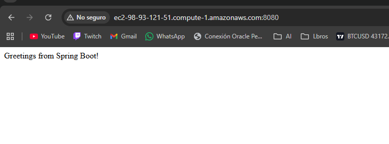

---

## Project Structure

```
NewSpringBoot/
├── src/
│   ├── main/
│   │   ├── java/
│   │   │   └── edu/co/escuelaing/arep/
│   │   │       ├── WebFramework.java                 # Entry point
│   │   │       ├── ComponentScanner.java             # Automatic scanning
│   │   │       ├── HTTPComponents/
│   │   │       │   ├── HttpServer.java               # HTTP server
│   │   │       │   ├── HttpRequest.java              # Request wrapper
│   │   │       │   ├── HttpResponse.java             # Response wrapper
│   │   │       │   └── WebMethod.java                # Functional interface
│   │   │       ├── annotations/
│   │   │       │   ├── RestController.java           # Class annotation
│   │   │       │   ├── GetMapping.java               # Method annotation
│   │   │       │   └── RequestParam.java             # Parameter annotation
│   │   │       └── controllers/
│   │   │           ├── HelloController.java          # Example controller
│   │   │           └── GreetingController.java       # Controller with params
│   │   └── resources/
│   │       └── webroot/
│   │           └── index.html                        # Static page
│   └── test/
│       └── java/
│           └── edu/co/escuelaing/arep/
│               └── AppTest.java
├── assets/                                           # README images
├── pom.xml                                           # Maven configuration
└── README.md
```

---

## How to Create a New Controller

### 1. Create the class with annotations:

```java
package edu.co.escuelaing.arep.controllers;

import edu.co.escuelaing.arep.annotations.RestController;
import edu.co.escuelaing.arep.annotations.GetMapping;
import edu.co.escuelaing.arep.annotations.RequestParam;

@RestController
public class UserController {

    @GetMapping("/users")
    public static String getUsers() {
        return "List of all users";
    }

    @GetMapping("/user")
    public static String getUser(@RequestParam(value = "id", defaultValue = "1") String id) {
        return "User with ID: " + id;
    }
}
```

### 2. Recompile:

```bash
mvn compile
```

### 3. Restart the server:

```bash
java -cp target/classes edu.co.escuelaing.arep.WebFramework
```

ComponentScanner will **automatically** detect and register your new controller. No configuration changes needed.

---

## Technical Features

### Inversion of Control (IoC)

The framework implements IoC through:

- **Automatic classpath scanning**: 
   - Recursively searches all classes in `edu.co.escuelaing.arep`
   - Filters only classes with `@RestController`

- **Dependency injection**:
   - Uses reflection to extract methods with `@GetMapping`
   - Processes parameters with `@RequestParam`
   - Injects values from HTTP query parameters


---

##  Author

**David Sarria - March 2026** 

