# MicroSpringBoot - IoC Framework for Java Web Applications

## Project Description

This project implements a **custom HTTP web server** in Java (without using Spring) with **Inversion of Control (IoC)** capabilities similar to Spring Boot. The current version focuses on three major goals:

- Concurrent HTTP request handling
- Graceful server shutdown
- Containerized deployment with Docker (local and AWS EC2)

The framework also keeps support for:

- Building web applications from POJOs (Plain Old Java Objects)
- Automatically scanning components with annotations
- Supporting custom annotations: `@RestController`, `@GetMapping`, `@RequestParam`

---

## Framework Architecture

### Main Components

1. **HttpServer**: HTTP server listening on port 8080
   - Handles HTTP GET requests
   - Routes requests to corresponding controllers
   - Serves static files from `/webroot`
   - Uses a thread pool to process requests concurrently
   - Registers a JVM shutdown hook for graceful termination

2. **ComponentScanner**: Automatic classpath scanning
   - Searches for classes annotated with `@RestController`
   - Registers methods with `@GetMapping`
   - Processes parameters with `@RequestParam`

3. **Custom Annotations**:
   - `@RestController`: Marks classes as web controllers
   - `@GetMapping(path)`: Maps methods to HTTP routes
   - `@RequestParam(value, defaultValue)`: Injects query parameters

4. **WebFramework**: Main entry point
   - Initializes ComponentScanner
   - Configures static files
   - Starts the HTTP server

---

## Implemented Features

### 1. Concurrent Request Handling

The server now handles multiple client requests at the same time by delegating each accepted socket to an `ExecutorService` thread pool.

This avoids the old sequential behavior where one slow request could block the next incoming requests.

### 2. Graceful Shutdown

The framework now supports graceful shutdown using a JVM shutdown hook:

- Stops the accept loop
- Closes the server socket
- Stops receiving new tasks in the thread pool
- Waits for in-flight requests to finish
- Forces shutdown only if timeout is exceeded

This behavior is triggered on controlled JVM termination events (for example, `Ctrl + C` or `System.exit()`).

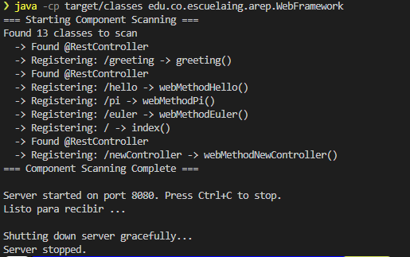

### 3. Docker Local Workflow

#### Step 1: Create Dockerfile
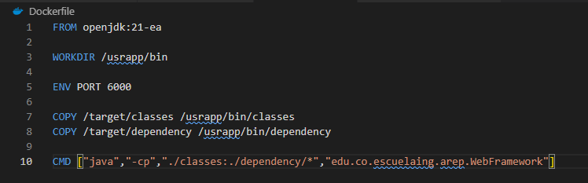

#### Step 2: Build image
```bash
docker build --tag microspringbootimage .
```
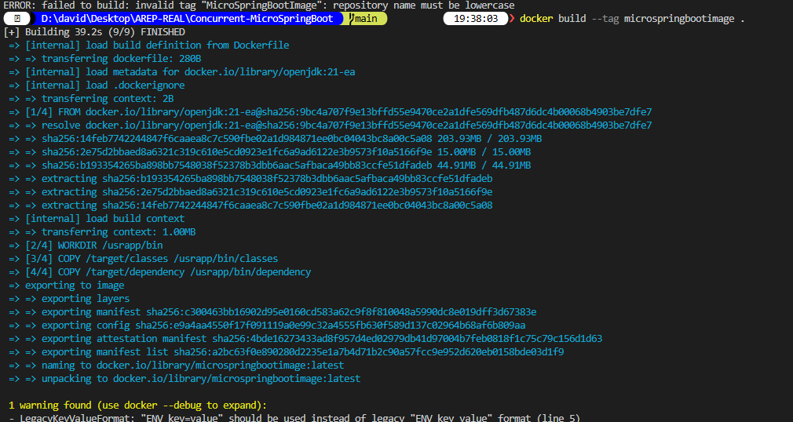
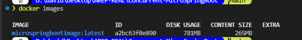

#### Step 3: Run container
```bash
docker run -d -p 34000:8080 --name primercontenedordemicrospringboot microspringbootimage
```
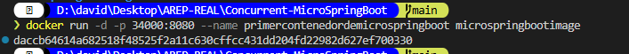
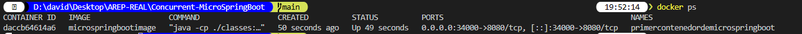

#### Step 4: Validate locally
Open:
```text
http://localhost:34000/
```
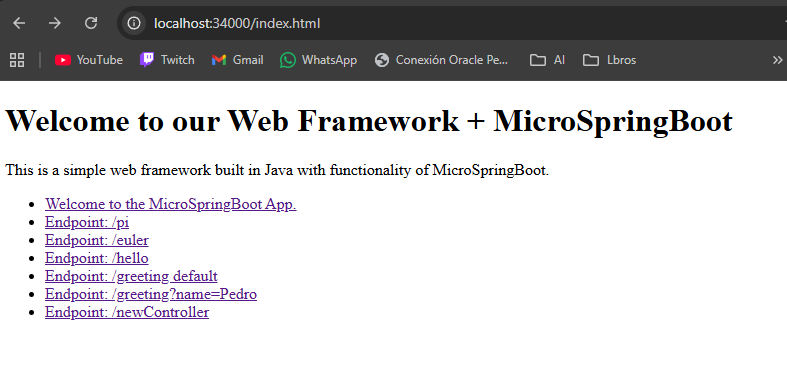

### 4. Docker Hub Publication

#### Step 1: Create Docker Hub repository
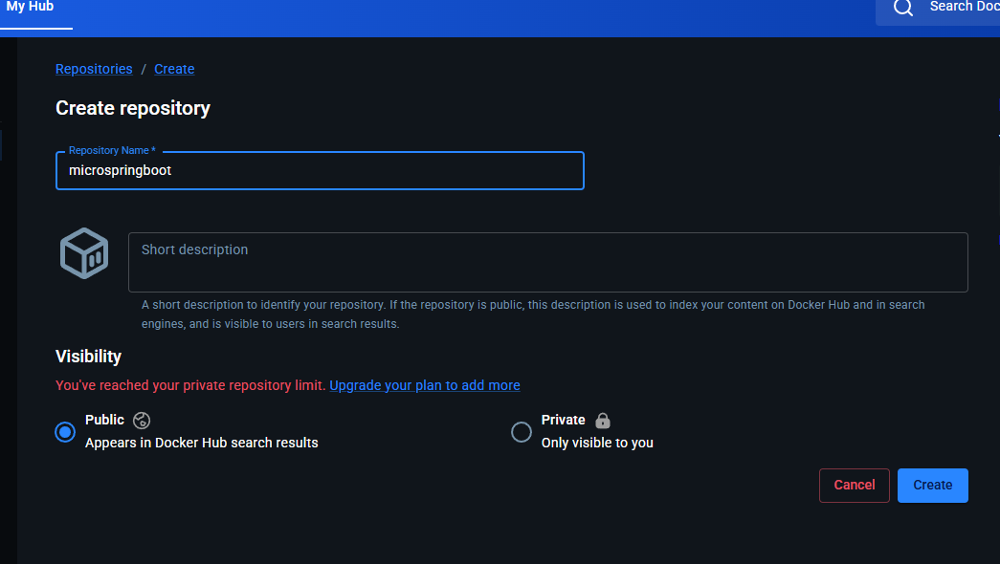

#### Step 2: Tag local image
```bash
docker tag microspringbootimage <dockerhub-user>/microspringboot:latest
```
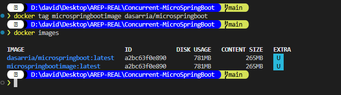

#### Step 3: Push image
```bash
docker push <dockerhub-user>/microspringboot:latest
```
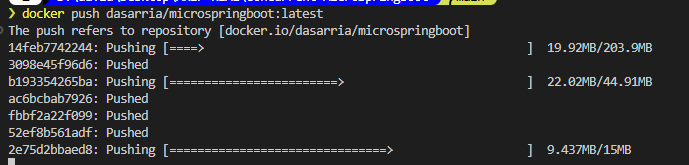
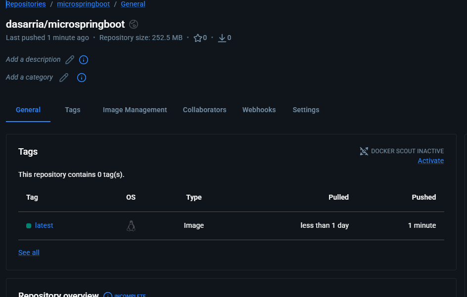

### 5. AWS EC2 Deployment with Docker

#### Step 1: Connect to EC2 instance
```bash
ssh -i your-key.pem ec2-user@your-instance-ip
```
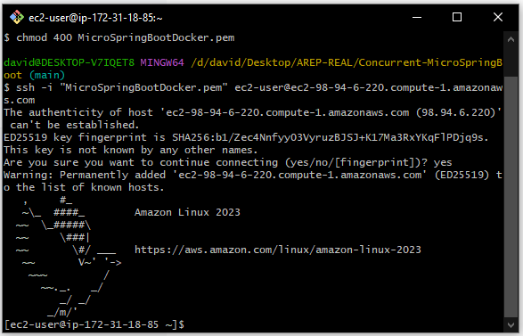

#### Step 2: Install Docker in EC2
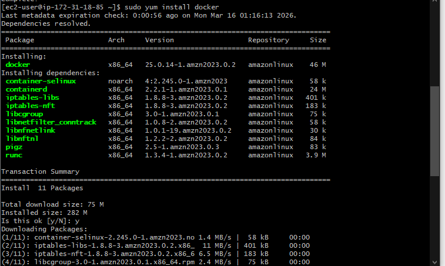

#### Step 3: Pull image and run container
```bash
docker pull <dockerhub-user>/microspringboot:latest
docker run -d -p 42000:8080 --name microspringboot-aws <dockerhub-user>/microspringboot:latest
```
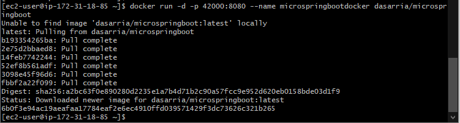

#### Step 4: Open EC2 inbound port
Allow inbound traffic on port `42000` in the Security Group.
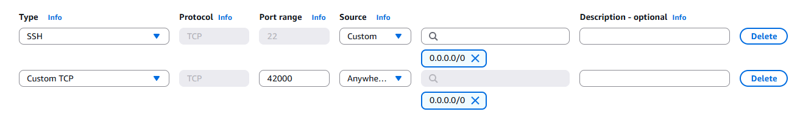

#### Step 5: Validate from browser
Open:
```text
http://your-ec2-public-ip:42000/
```
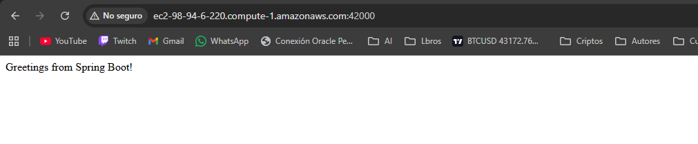
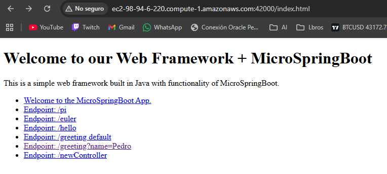

---

## Local Installation and Execution

### Prerequisites

- **Java 17** or higher
- **Maven 3+**
- **Git**

### Step 1: Clone the Repository

```bash
git clone https://github.com/DASarria/Concurrent-MicroSpringBoot.git
cd Concurrent-MicroSpringBoot
```

### Step 2: Compile the Project

```bash
mvn clean compile
```

### Step 3: Run the Server

```bash
java -cp target/classes edu.co.escuelaing.arep.WebFramework
```

### Step 4: Access the Application

Open your browser and visit:

```text
http://localhost:8080/
```

### Available Endpoints

| Route | Description |
|-------|-------------|
| `/` | Welcome page |
| `/pi` | Returns the value of PI |
| `/euler` | Returns Euler's number |
| `/hello` | Simple greeting |
| `/greeting` | Greeting with optional parameter `?name=YourName` |
| `/newController` | Dynamic controller example |

---

## Project Structure

```text
Concurrent-MicroSpringBoot/
├── src/
│   ├── main/
│   │   ├── java/
│   │   │   └── edu/co/escuelaing/arep/
│   │   │       ├── WebFramework.java                 # Entry point
│   │   │       ├── ComponentScanner.java             # Automatic scanning
│   │   │       ├── MicroSpringBoot.java              # Reflection-based launcher
│   │   │       ├── HTTPComponents/
│   │   │       │   ├── HttpServer.java               # Concurrent HTTP server + graceful shutdown
│   │   │       │   ├── HttpRequest.java              # Request wrapper
│   │   │       │   ├── HttpResponse.java             # Response wrapper
│   │   │       │   └── WebMethod.java                # Functional interface
│   │   │       ├── annotations/
│   │   │       │   ├── RestController.java           # Class annotation
│   │   │       │   ├── GetMapping.java               # Method annotation
│   │   │       │   └── RequestParam.java             # Parameter annotation
│   │   │       └── controllers/
│   │   │           ├── HelloController.java          # Example controller
│   │   │           ├── GreetingController.java       # Controller with params
│   │   │           └── NewController.java            # Additional controller example
│   │   └── resources/
│   │       └── webroot/
│   │           └── index.html                        # Static page
│   └── test/
│       └── java/
│           └── edu/co/escuelaing/arep/
│               └── AppTest.java
├── assets/                                           # README images
├── Dockerfile                                        # Container image definition
├── pom.xml                                           # Maven configuration
└── README.md
```

---

## Technical Features

### Inversion of Control (IoC)

The framework implements IoC through:

- **Automatic classpath scanning**:
  - Recursively searches all classes in `edu.co.escuelaing.arep`
  - Filters only classes with `@RestController`

- **Dependency injection**:
  - Uses reflection to extract methods with `@GetMapping`
  - Processes parameters with `@RequestParam`
  - Injects values from HTTP query parameters

### Concurrency and Graceful Termination

- Fixed-size thread pool for request concurrency
- Controlled shutdown flow through JVM shutdown hook
- Proper release of socket and executor resources

---

##  Author

**David Sarria - March 2026**

